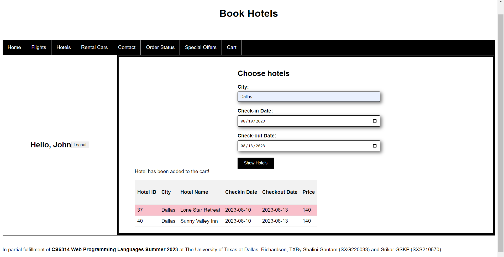

# Travel Planning Application
Using PHP, JavaScript, JQuery, MySQLi, CSS

Built in partial fulfillment of:
```
Course: CS 6314 Web Programming Languages
Instructor: Dr. Gity Karami
Teaching Assistant: Amin Birashk
Organisation: The University of Texas at Dallas, Richardson, Texas
```
## Few screens from the applications
### Login or sign up


### Select from available flights and add to cart


### Select from available hotels and add to cart


### Display cart


### Order status (for the logged-in user)


## Acknowledgments
- Dr. Gity Karami - Instructor
    - Designed the requirements for the project.
- Amin Birashk - Teaching Assistant
- Shalini Gautam
    - Project partner.
